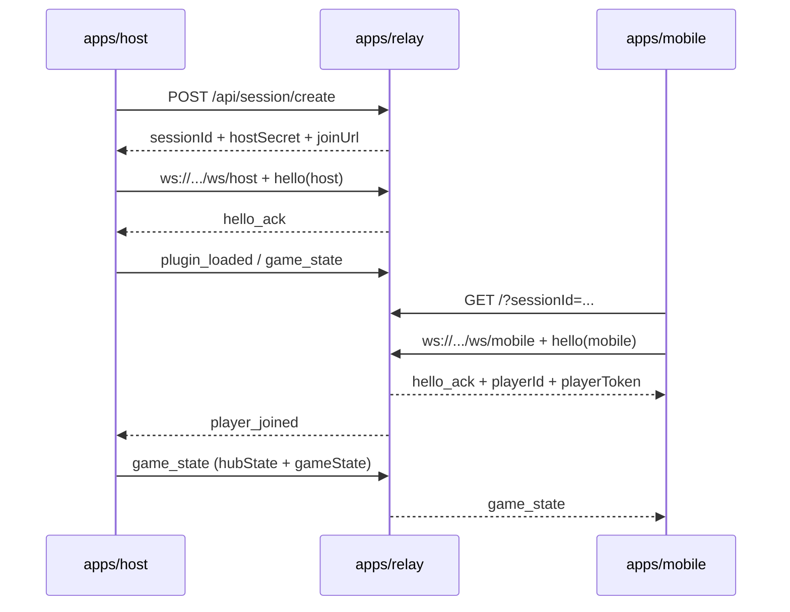
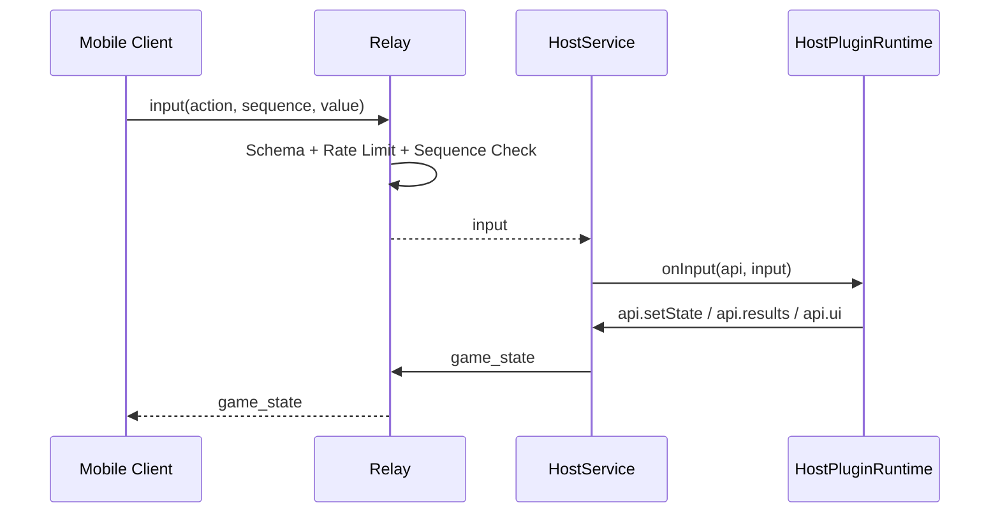
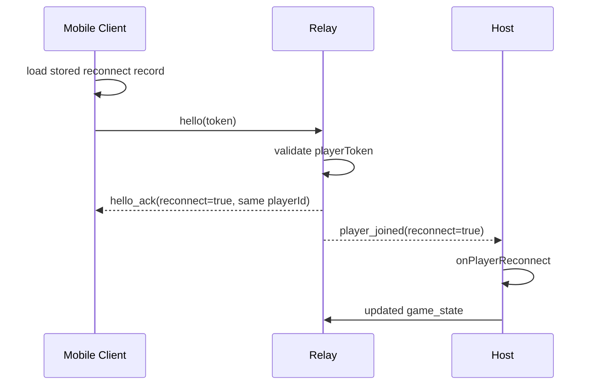
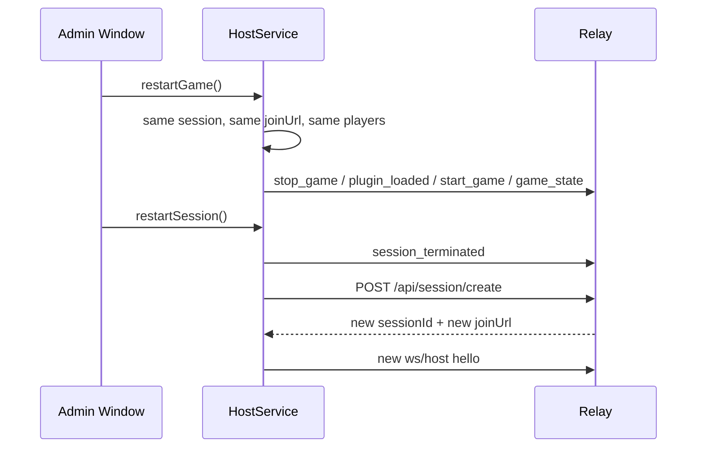

# Game Hub Architecture Overview

## Zielbild in einem Satz

Game Hub ist eine lokale Host-Anwendung mit autoritativer Spiellogik, einem oeffentlichen Relay fuer Join und Routing, browserbasierten Mobile-Clients fuer Spieler-Eingaben und pluginbasierten Spielen fuer Regeln plus UI.

## Komponentenkarte

| Bereich | Rolle | Besitz / Verantwortung | Was dort bewusst nicht passiert |
| --- | --- | --- | --- |
| `apps/host` | Lokaler autoritativer Host | Session-Steuerung, Plugin-Runtime, Ranking, Match-Status, Admin-UI, Central-Screen | Keine oeffentliche Erreichbarkeit fuer Spieler-Join |
| `apps/relay` | Oeffentlicher HTTP/WebSocket-Relay | Session-Erstellung, Join-URL, Routing Host <-> Mobile, statisches Mobile-Serving | Keine Spielentscheidungen, keine eigentliche Spiellogik |
| `apps/mobile` | Browser-Client fuer Spieler | Join, Reconnect, Mobile-UI, Inputs zum Host | Keine autoritative Spiellogik |
| `packages/protocol` | Geteiltes Wire-Format | Zod-Schemas fuer Nachrichten und Payloads | Keine Runtime-Logik |
| `packages/sdk` | Plugin-SDK | Manifest, Host-API, React-Props, Plugin-Vertrag | Kein Transport / kein Relay |
| `plugins/*` | Spiele als Plugins | Spielregeln, oeffentlicher `gameState`, Mobile-/Central-UI | Kein Sessionmanagement, kein Join-Protokoll |

## Architekturprinzipien

- **Host-Autoritaet**: Nur der Host trifft verbindliche Spielentscheidungen.
- **Relay als Router**: Das Relay erstellt Sessions und routed Nachrichten, besitzt aber keine Spielregeln.
- **Getrennter State**: `hubState` beschreibt Session, Ranking und Shell-Zustand. `gameState` beschreibt den oeffentlichen Zustand des aktiven Spiels.
- **Plugin-Modell**: Spiele sind TypeScript-/React-Plugins mit klaren Hooks und UIs.
- **Zwei Anzeigeebenen**: Der Central Screen ist die gemeinsame Buehne fuer alle. Mobile ist die persoenliche Spieleroberflaeche.
- **First-party Trust Default**: Plugins laufen im Host-Prozess und gelten aktuell als vertrauter Code.

## Repo-Orientierung

| Wenn du X verstehen willst | Lies zuerst |
| --- | --- |
| Join, Hello, WebSocket-Routing | `apps/relay/src/server.ts` |
| Plugin-Vertrag und UI-Props | `packages/sdk/src/index.ts` |
| Nachrichtenschemas / Payloads | `packages/protocol/src/messages.ts` |
| Host-Lifecycle, Restart, Broadcast | `apps/host/src/host-service.ts` |
| Plugin-Runtime und Hooks | `apps/host/src/plugin-runtime.ts` |
| Mobile Join-/Reconnect-Flow | `apps/mobile/src/App.tsx` |
| Electron-Fenster, IPC, Central/Admin | `apps/host/bootstrap.cjs` und `apps/host/preload.cjs` |

## Komponenten im Detail

### `apps/relay`

Der Relay ist der einzige oeffentliche Einstiegspunkt.

- `POST /api/session/create` erzeugt eine neue Session mit `sessionId`, `hostSecret` und `joinUrl`.
- `/ws/host` nimmt die Host-Verbindung an.
- `/ws/mobile` nimmt Browser-/Mobile-Verbindungen an.
- `/` und `/assets/*` liefern die gebaute Mobile-App aus.

Wichtig:

- Der Relay kennt Sessions und Spieler-Verbindungen, aber **keine Spielregeln**.
- Die Session liegt aktuell **nur im Memory**.
- Bei Deploy oder Prozess-Neustart gehen laufende Sessions verloren.

### `apps/host`

Der Host ist der eigentliche Spielserver.

- erstellt Sessions ueber den Relay
- verbindet sich per WebSocket als Host
- laedt und steuert Plugins
- fuehrt `onTick`, `onInput`, `onPlayerJoin` usw. aus
- berechnet Ranking, Badges, Overlay und Match-Status
- broadcastet `game_state` an den Relay

Der Host besitzt zwei Fensterrollen:

- **Admin Window**: Steuerung, Lobby, Diagnostics, Game-Auswahl
- **Central Window**: gemeinsame Vollbild-Spielbuehne

### `apps/mobile`

Mobile ist der Spieler-Client im Browser.

- liest `sessionId` aus der URL
- fuehrt `hello` gegen `/ws/mobile` aus
- speichert Reconnect-Token browserseitig
- rendert Lobby + Mobile-UI des aktiven Plugins
- sendet `input`-Nachrichten an den Relay

### `packages/protocol`

Hier liegt das echte Wire-Format.

Wichtige Nachrichten:

- `hello`
- `hello_ack`
- `input`
- `plugin_loaded`
- `game_state`
- `session_terminated`
- `error`

Wichtige Payloads:

- `HubStatePayload`
- `GameStateEnvelopePayload`
- `HostPlayerState`
- `SessionLeaderboardEntry`

### `packages/sdk`

Das SDK definiert den Plugin-Vertrag.

Wichtige Typen:

- `GamePluginDefinition`
- `GameManifest`
- `GameHostApi`
- `GameMobileProps`
- `GameCentralProps`
- `GameControlSchema`
- `HubSessionState`

## State Ownership

### Hub-owned State

Der Host besitzt den Hub-State und broadcastet ihn als `hubState`.

Typische Felder:

- `joinUrl`
- `sessionId`
- `lifecycle`
- `relayStatus`
- `selectedGame`
- `players`
- `leaderboard`
- `matchStatus`
- `overlay`
- `statusBadges`

Dieser State beschreibt also **Session und Shell**, nicht die Spielwelt.

### Plugin-owned Public State

Das aktive Spiel besitzt den oeffentlichen `gameState`.

Beispiele:

- Snake: Grid, Snakes, Countdown, Gewinner
- Trivia: Stage, aktuelle Frage, Reveal, Scores

Wichtig:

- `gameState` wird an alle relevanten UIs verteilt.
- `gameState` darf keine geheimen oder nur hostseitig erlaubten Informationen enthalten.
- Host-interne Queues, Seeds, Debug-Details oder rohe Tokens gehoeren nicht hinein.

### Host-interner State

Der Host hat zusaetzlich internen Runtime-State, der **nicht** broadcastet wird.

Beispiele:

- WebSocket-Objekte
- Lifecycle-Queue / Restart-Serialisierung
- Tick-Timer
- plugin-interne Zwischenzustandsstrukturen
- Secret-/Reconnect-relevante Daten

## Verbindungs- und Nachrichtenfluss

### Host-Start bis spielbarer Session

### Input-Fluss

### Reconnect

### Restart Game vs Restart Session

## Session-Lifecycle

### 1. Session-Erstellung

- Host startet
- Host ruft `POST /api/session/create` auf
- Relay liefert `sessionId`, `hostSecret`, `joinUrl`

### 2. Host-Verbindung

- Host verbindet sich auf `/ws/host`
- `hello` identifiziert ihn mit `hostSecret`
- Relay markiert Session als host-verbunden

### 3. Mobile Join

- Spieler oeffnen `joinUrl`
- Mobile-App liest `sessionId`
- Browser verbindet sich auf `/ws/mobile`
- Relay liefert `playerId`, `playerToken`, `phase`

### 4. Lobby

- Host aktualisiert Snapshot / Lobby / Moderator / Teams
- Plugin kann `onPlayerJoin` und `onSessionCreated` nutzen

### 5. Game Start

- Admin waehlt Plugin und startet das Spiel
- Host ruft Plugin-Hooks auf
- Host tickt optional ueber `manifest.tickHz`
- `hubState.lifecycle` geht auf `game_running`

### 6. Stop / Restart Game

- `Restart Game` behaelt Session, Join-URL und Spieler
- Plugin wird neu initialisiert
- Runde startet erneut ohne Rejoin

### 7. Restart Session

- Alte Session wird beendet
- Neue Session wird erstellt
- Neuer QR-Code / neue Join-URL

### 8. Termination

- Host stoppt
- Relay terminiert Session
- Mobile bekommt `session_terminated`

## Host-Fenster und UI-Rollen

### Admin Window

Das Admin-Fenster ist die Steueroberflaeche.

- Session-Code / QR
- Lobby / Moderator / Game-Auswahl
- Start / Stop / Restart
- Diagnostics
- kleine Live-Preview der zentralen Plugin-UI

Nur hier erlaubt:

- `selectGame`
- `setModerator`
- `startGame`
- `stopGame`
- `restartSession`
- `sendPluginAction`

### Central Window

Das Central-Fenster ist die gemeinsame Vollbild-Buehne.

- rendert `plugin.ui.central`
- besitzt eine Host-Shell fuer Fullscreen / Restart Game / Close
- ist absichtlich von der Admin-Steuerung getrennt

### Mobile Screen

Mobile rendert `plugin.ui.mobile`.

- persoenlicher Kontext
- Eingaben
- private Orientierung / HUD
- keine hostseitige Autoritaet

## Wichtige Schnittstellen

### `GamePluginDefinition`

Definiert ein Spiel als Plugin.

Bestandteile:

- `manifest`
- `createInitialState`
- optional `parseInput`
- `server`
- `ui`
- optional `controls`

### `GameManifest`

Beschreibt das Plugin fuer Auswahl, Taktung und Faehigkeiten.

Wichtige Felder:

- `id`
- `displayName`
- `version`
- `supportsTeams`
- `tickHz`
- `inputMode`
- `uiSlots`

### `GameHostApi`

Host-seitige Capability fuer Plugins.

Wichtige Bereiche:

- `getPlayers()`
- `getSnapshot()`
- `setState()` / `updateState()`
- `results.*`
- `session.*`
- `ui.*`
- `log(...)`

### `GameMobileProps`

Props fuer `plugin.ui.mobile`.

- `gameState`
- `hubSession`
- `phase`
- `players`
- `playerId`
- `role`
- `sendInput(action, payload)`

### `GameCentralProps`

Props fuer `plugin.ui.central`.

- `gameState`
- `hubSession`
- `phase`
- `players`
- `invokeHostAction(action, payload)`

### `GameControlSchema`

Deklaratives Control-Modell fuer Spiele, die keine komplett eigene Mobile-Oberflaeche brauchen.

Typische Einsaetze:

- D-Pad fuer Realtime-Spiele
- Action-Buttons fuer einfache Party-Games
- Auswahl- oder Voting-Flaechen fuer turn-based Spiele

Wichtig:

- `controls` ist ein Hub-Primitive, kein Ersatz fuer komplette persoenliche HUDs
- wenn dein Spiel private Orientierung, Minimap oder komplexe Formulare braucht, ist `plugin.ui.mobile` oft die bessere Hauptschnittstelle
- `controls` und eigene Mobile-UI koennen kombiniert werden, sollten dann aber klar getrennte Rollen haben

### `HubSessionState`

Der Hub broadcastet diesen Zustand an Central- und Mobile-UIs.

Typische Inhalte:

- Session-Meta wie `sessionId`, `joinUrl`, `selectedGame`
- Lifecycle und Match-Status
- Player-Liste und session-lokales Ranking
- Overlay, Status-Badges und hostseitige Shell-Informationen

Wichtig:

- `HubSessionState` ist platform-owned
- Plugins duerfen ihn lesen, aber nicht direkt "besitzen"
- Aenderungen laufen ueber `GameHostApi.session`, `GameHostApi.results` und `GameHostApi.ui`

### `GameResultsCapability`

Fuer session-lokales Ranking und Ergebnisintegration.

Wichtig:

- `recordPlayerWin`
- `awardPlayerPoints`
- `awardTeamPoints`
- `setPlayerScore`
- `setPlayerStatus`
- `recordPlacement`
- `endRound`
- `endMatch`

## Plugin-Lifecycle

### Discovery und Trust Gate

- Host scannt `plugins/*`
- standardmaessig werden nur first-party Plugins geladen
- nicht vertraute Plugins brauchen `ALLOW_UNTRUSTED_PLUGINS=true`

### Aktivierung

- Admin waehlt ein Spiel
- Host laedt Manifest + Plugin-Modul
- `createInitialState()` initialisiert den ersten `gameState`

### Runtime-Hooks

Host ruft je nach Ereignis folgende Hooks:

- `onSessionCreated`
- `onPlayerJoin`
- `onPlayerLeave`
- `onPlayerReconnect`
- `onGameStart`
- `onGameStop`
- `onInput`
- `onTick`

### Broadcast und Shell-Integration

Plugins muessen nicht selbst Sessions, Lobby oder Ranking rendern.

Sie koennen stattdessen:

- `api.setState(...)`
- `api.ui.publishStatusBadges(...)`
- `api.ui.setOverlay(...)`
- `api.results.*`

nutzen, damit der Hub die Shell konsistent fuellt.

## Ranking, Results und Match-Status

Der Hub besitzt das session-lokale Ranking.

Plugins melden Ergebnisse ueber `results`.

Beispiele:

- Snake: `recordPlayerWin`, `endRound`
- Trivia: `awardPlayerPoints`, `setPlayerScore`, `endMatch`

Der Hub verwendet diese Informationen fuer:

- Lobby-Anzeigen
- Central-Header
- Result-Screens / Match-Status
- Player-Statuswerte wie `alive`, `dead`, `winner`, `offline`

Regel:

- **Spielregeln bleiben im Plugin**
- **sessionweite Meta-Auswertung bleibt im Hub**

## Security- und Trust-Boundaries

### Public Relay

- internet-erreichbar
- validiert Protokoll, Origins und Limits
- besitzt keine Spielregeln

### Browser / Mobile

- bekommt nur oeffentlichen State
- speichert Reconnect-Token browserseitig
- darf niemals als autoritative Quelle behandelt werden

### Host

- vertraute, autoritative Runtime
- besitzt Restart-, Ranking- und Plugin-Kontrolle

### Plugins

- aktuell trusted code im Host-Prozess
- keine Sandbox fuer Community-Code
- deshalb sind Plugins derzeit eher interner als untrusted Drittcode

### Residual Risks

- Relay-Sessions sind in-memory
- untrusted Plugins sind nicht isoliert
- Browserseitige Reconnect-Tokens bleiben XSS-sensitiv
- Host-Disconnect terminiert aktuell die Session

## Betriebsgrenzen

- Keine Persistenz ueber Relay-Neustarts
- Kein Resume nach Deploy
- Public Betrieb braucht `PUBLIC_BASE_URL`
- Mobile Clients sprechen immer den Relay, nicht direkt den Host
- Host bleibt lokal; Relay kann oeffentlich gehostet werden

## Was lokal und was oeffentlich laufen muss

| Teil | Lokal | Oeffentlich |
| --- | --- | --- |
| Host / Electron | Ja | Nein |
| Relay | Optional lokal fuer Dev | Ja fuer echte Handy-Joins ueber Internet |
| Mobile-App | Wird ueber Relay ausgeliefert | Ja, wenn Handys extern joinen |
| Plugins | Im Host-Prozess | Nicht separat deployed |

## Fazit

Die Architektur ist bewusst asymmetrisch:

- **Host** entscheidet
- **Relay** verbindet
- **Mobile** interagiert
- **Plugins** liefern Spielregeln und UIs innerhalb der vorhandenen Plattform

Genau dadurch kann ein neues Spiel in Game Hub integriert werden, ohne Sessionmanagement, Routing, Ranking und Fensterlogik jedes Mal neu zu bauen.
